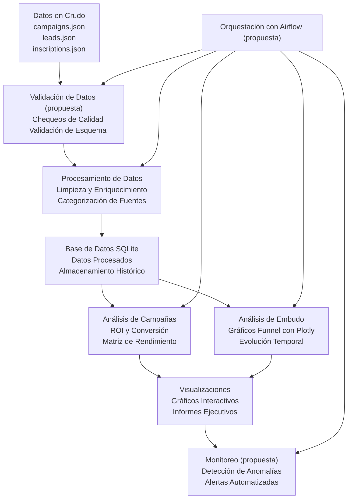
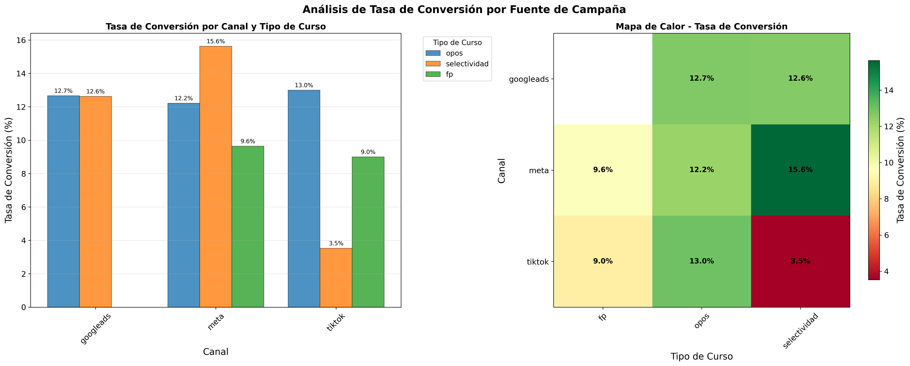
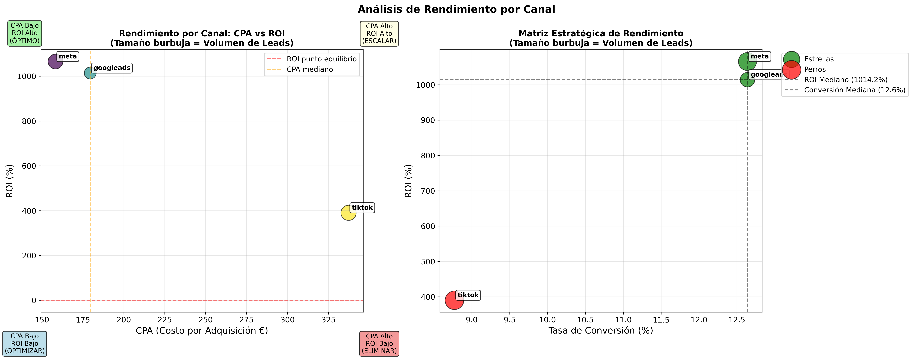
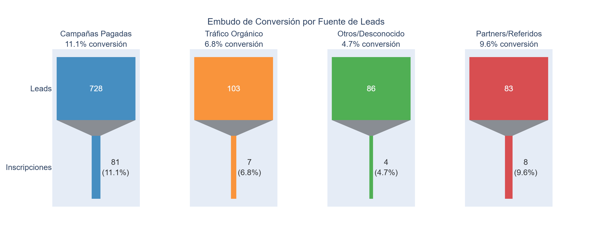
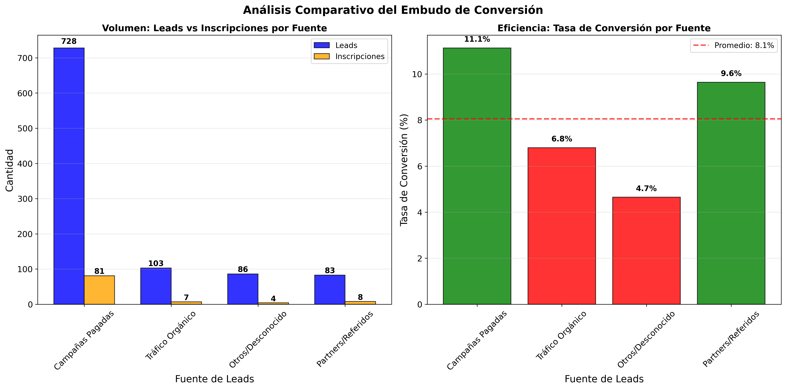
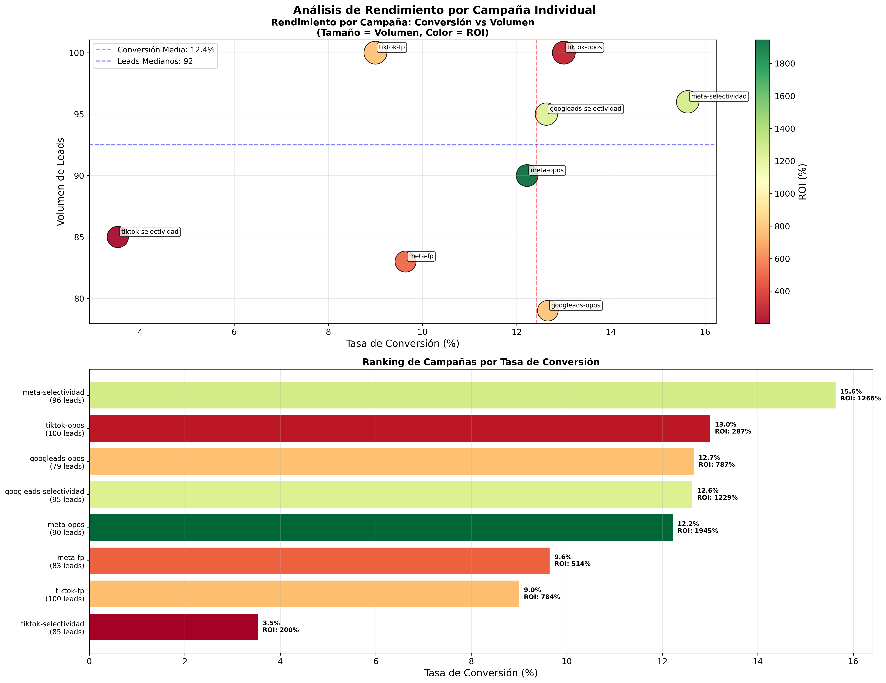
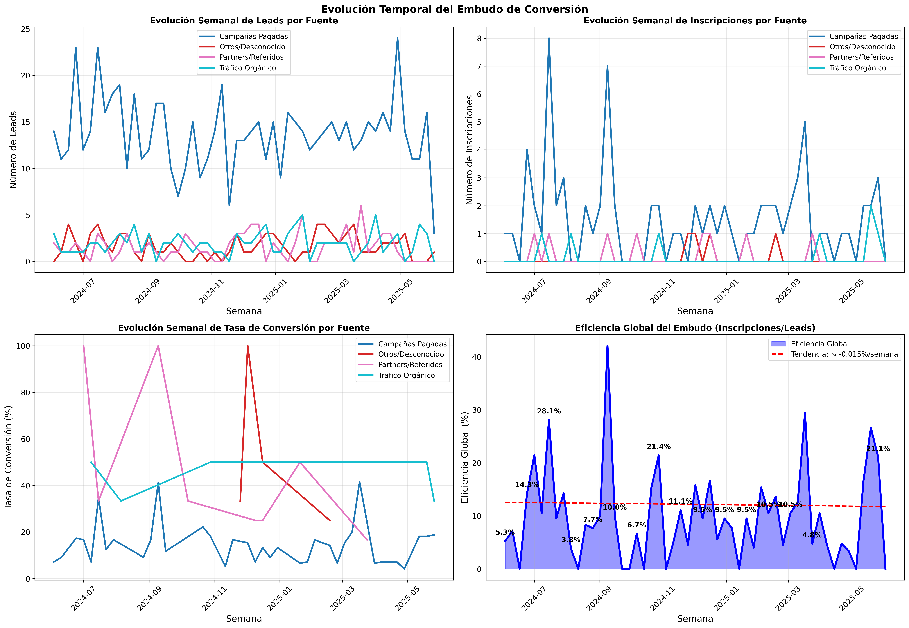

# Ucademy Data Assessment

[](https://www.python.org/downloads/)
[](requirements.txt)  
[](https://github.com/celiacnavarro/ucademy-data-assessment/commits/main)


Solución de análisis de marketing digital para optimización de campañas, con propuestas de automatización, validación de datos y monitoreo. Incluye procesamiento, análisis de embudos y visualizaciones.

## Objetivos Resueltos

### **Objetivo 1: Análisis de Fuentes de Campaña**
- Métricas de conversión y ROI por canal
- Optimización de inversión publicitaria  
- Identificación de campañas top performers

### **Objetivo 2: Embudo de Conversión**
- Análisis de flujo leads → inscripciones
- Gráficos de embudo / Funnel charts
- Evolución temporal de conversion rates

### **Objetivo 3: Propuesta de Automatización** 
- Diseño conceptual de pipeline de datos end-to-end
- Propuesta de validación automática de calidad
- Esquema de alertas y monitoreo en tiempo real

---

## Estructura del Proyecto

```
ucademy-data-assessment/
├── src/                            # Código fuente del proyecto
│   ├── data_preprocessing.py       # Limpieza, validación y transformación de datos
│   ├── campaign_source_analysis.py # Objetivo 1: Conversión por fuente de campaña
│   └── lead_conversion_funnel_analysis.py # Objetivo 2: Porcentaje de conversión de leads
├── data/                           # Datos crudos para procesar
├── output/                         # Resultados generados 
│   ├── processed_data/             # Datos procesados y listos para análisis
│   ├── campaign_source_analysis/   # Resultados del objetivo 1
│   └── lead_conversion_funnel/     # Resultados del objetivo 2
├── notebooks/                      # Notebooks para exploración y pruebas
├── docs/                           # Documentación del proyecto
│   ├──  Automation_proposal.md     # Propuesta de automatización
│   └── src/                        # Documentación HTML generada para cada script
├── .gitignore                      # Archivos/carpetas que Git debe ignorar (ej. venv, __pycache__)
├── README.md                       # Este archivo
└── requirements.txt                # Dependencias necesarias
     
```
---
## Requisitos Técnicos

- **Python 3.9+**  
- **Librerías**: Pandas, NumPy  
- **Visualización**: Plotly, Matplotlib, Seaborn  
- **Procesamiento de datos**: SQL, JSON, análisis de series temporales  
- **Base de datos**: SQLite
- **Notebook**: Jupyter Notebook para exploración de datos inicial

## Arquitectura de la Solución



#### Notas:

- Las secciones marcadas como *(propuesta)* no están implementadas actualmente y forman parte de un plan futuro de automatización descrito en  `automation_proposal.md `.

- El flujo principal actual incluye ingestión de datos, procesamiento, almacenamiento, análisis y visualización.

---

## Quick Start

### **Instalación Local**
```bash

# Clonar repositorio
git clone https://github.com/celiacnavarro/ucademy-data-assessment.git
cd ucademy-data-assessment

# Crear un entorno virtual (recomendado)
python -m venv venv
source venv/bin/activate  # En Unix/macOS
# o
.\venv\Scripts\activate  # En Windows

# Instalar dependencias
pip install -r requirements.txt

# Ejecutar pipeline completo
python src/data_preprocessing.py
python src/campaign_source_analysis.py  
python src/lead_conversion_funnel_analysis.py
```

---

## Resultados y Visualizaciones

### Conversión por Fuente de Campaña

<div align="center">
  <figure>
    
    <figcaption><strong>Análisis de Tasa de Conversión por Fuente de Campaña</strong></figcaption>
    <p style="max-width:600px; margin:auto; font-size:14px;">
      Por tipo de curso, selectividad en Meta obtiene el mejor rendimiento (15.6%), mientras que FP muestra consistencia entre canales (9-13%). El mapa de calor revela que Meta es especialmente efectivo para selectividad, y Google Ads mantiene rendimientos equilibrados entre todos los tipos de curso.
    </p>
  </figure>
</div>


<div align="center">
  <figure>
    
    <figcaption><strong>Análisis de Rendimiento por Canal</strong></figcaption>
    <p style="max-width:600px; margin:auto; font-size:14px;">
      La matriz estratégica posiciona a Meta como estrella (alto ROI, alta conversión), Google Ads como solución equilibrada, y TikTok en zona de optimización. Meta presenta el ROI más alto (1014%) con conversión del 12.6%, mientras que TikTok requiere mejoras con ROI del 400% y conversión del 9%.
    </p>
  </figure>
</div>


### Porcentaje de Conversión de Leads

<div align="center">
  <figure>
    
    <figcaption><strong>Embudo de Conversión Segmentado por Fuente de Lead</strong></figcaption>
    <p style="max-width:600px; margin:auto; font-size:14px;">
      Las campañas pagadas dominan el volumen total con 728 leads y una conversión del 11.1%, seguidas por partners/referidos que, aunque con menor volumen (83 leads), mantienen una eficiencia competitiva del 9.6%. El tráfico orgánico muestra el menor rendimiento con solo 6.8% de conversión.
    </p>
  </figure>
</div>


<div align="center">
  <figure>
    
    <figcaption><strong>Análisis Comparativo del Embudo de Conversión</strong></figcaption>
    <p style="text-align:center; max-width:600px;">
      La comparativa consolidada confirma que las campañas pagadas generan el 72.8% del volumen total de leads (728 de 1000), superando significativamente el promedio de conversión del 8.1%. Los partners/referidos destacan por su eficiencia, alcanzando el 9.6% de conversión con una inversión mínima.
    </p>
  </figure>
</div>


<div align="center">
  <figure>
    
    <figcaption><strong>Análisis de Rendimiento por Campaña Individual</strong></figcaption>
    <p style="text-align:center; max-width:600px;">
      El análisis de rendimiento individual muestra que meta-selectividad lidera con una tasa de conversión del 15.6% y ROI del 1264%, mientras que tiktok-selectividad presenta el menor rendimiento con 3.5% de conversión. Las campañas de oposiciones mantienen consistencia en volumen de leads (90-100) con conversiones variables entre 9-13%.
    </p>
  </figure>
</div>

<div align="center">
  <figure>
    
    <figcaption><strong>Análisis Temporal del Embudo de Conversión.</strong></figcaption>
    <p style="text-align:center; max-width:600px;">
      El análisis temporal revela una tendencia descendente en la eficiencia global (-0.015% por semana), con picos de rendimiento del 42% en ciertas semanas. Las campañas pagadas mantienen estabilidad en generación de leads (10-25 semanales), mientras que otras fuentes presentan mayor volatilidad.
    </p>
  </figure>
</div>

## Insights Clave para Negocio

-  **Meta lidera en eficiencia**: ROI superior al 1000% y conversiones del 15.6% en selectividad
- **Google Ads mantiene estabilidad**: rendimiento equilibrado entre todos los tipos de curso (12-13% conversión)
- **TikTok requiere optimización**: conversión 4x menor que Meta en selectividad (3.5% vs 15.6%)
- **Partners/referidos** presentan alta eficiencia: 9.6% conversión con inversión mínima
---

## Propuesta de Automatización

En este proyecto se plantea una arquitectura inicial de datos orientada a **automatizar el procesamiento, análisis y monitorización de métricas de marketing digital**. El objetivo es reducir el trabajo manual, minimizar errores humanos y optimizar el tiempo de análisis, garantizando datos fiables y actualizados para la toma de decisiones.

La solución incluye un **pipeline automatizado** que cubre desde la ingesta de datos hasta la generación de reportes y dashboards interactivos, pasando por validación, procesamiento analítico, almacenamiento versionado y monitorización.

Para más detalle sobre la arquitectura propuesta, casos de uso y próximos pasos, consulta el documento completo:  
[Propuesta de Automatización](docs/automation_proposal.md)

## Notas

- Este proyecto es una prueba técnica desarrollada como parte de un proceso de entrevista.

- La sección de automatización, validación de datos y monitoreo es una propuesta conceptual no implementada.

- Todo el código y documentación están orientados a demostrar capacidades analíticas y estructuración de un pipeline de datos.

## Contacto

Si tienes dudas o quieres comentar el proyecto:  

📧 Email: celiacnavarro@gmail.com  
🔗 LinkedIn: [Celia Cabello Navarro](https://www.linkedin.com/in/celiacabellonavarro)
>>>>>>> e965edd (Primer commit)
