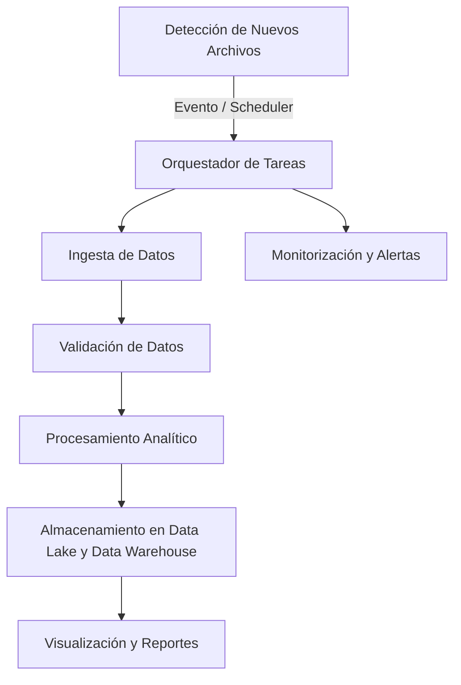

# PROPUESTA DE AUTOMATIZACIÓN

## Descripción

Esta propuesta presenta una arquitectura inicial de datos orientada a automatizar de forma eficiente el procesamiento, análisis y monitorización de métricas de marketing digital. El objetivo es establecer una infraestructura de datos robusta, capaz de garantizar actualizaciones recurrentes, control de calidad, trazabilidad completa y escalabilidad futura. Este planteamiento permitirá no solo obtener métricas precisas de forma automática, sino también construir una base sólida para futuras mejoras y ampliaciones de la infraestructura analítica.

La solución propuesta busca **minimizar el trabajo manual**, **reducir errores humanos** y **optimizar el tiempo de análisis**, facilitando que el equipo de marketing disponga de insights fiables y actualizados para la toma de decisiones estratégicas.

## Arquitectura de la Solución

La arquitectura planteada consiste en un **pipeline automatizado** que gestiona todo el flujo de trabajo, desde la ingesta inicial de datos hasta la entrega de reportes y dashboards interactivos. La coordinación se realiza mediante un **orquestador de tareas**, como Apache Airflow, que permite definir dependencias entre tareas, programar ejecuciones periódicas y supervisar cada etapa del proceso en tiempo real.

Esta estructura asegura que el flujo de trabajo sea **repetible**, **auditable** y **escalable**, evitando cuellos de botella y facilitando la incorporación de nuevos datasets o métricas en el futuro.

### 1. Ingesta de Datos

La ingesta de datos es el punto de partida del pipeline. Se centra en la carga automática de archivos clave: **campaigns.json**, **leads.json** e **inscriptions.json**. El orquestador actúa como scheduler, detectando la llegada de nuevos archivos o revisando carpetas específicas de almacenamiento compartido.

**Opciones de implementación:**

- **Almacenamiento en la nube** (AWS S3, Google Cloud Storage, Azure Blob Storage): el sistema se conecta directamente al bucket y detecta automáticamente la subida de nuevos archivos, disparando la ejecución del pipeline sin intervención manual.

- **Repositorio interno compartido**: el scheduler revisa periódicamente carpetas en servidores locales, detectando cambios o nuevos archivos y lanzando el flujo de procesamiento.

**Ejemplo:** cada viernes, el equipo de captación exporta desde sus plataformas de anuncios los datos en formato JSON hacia un bucket de S3. El sistema detecta la actualización y arranca automáticamente todo el flujo de procesamiento, evitando tareas manuales y asegurando que los datos estén disponibles el lunes por la mañana.

Este enfoque permite escalar la ingesta conforme crece el volumen de datos, incorporando nuevas fuentes sin alterar la arquitectura central.

### 2. Control y Validación de Datos

Antes de cualquier análisis, los datos deben pasar por un proceso riguroso de validación para garantizar su **calidad**, **integridad** y **consistencia**. Este control evita errores que puedan afectar los KPIs y asegura que los informes generados sean fiables.

**Las validaciones clave incluyen:**

- **Tipos de datos**: estandarización de formatos monetarios, normalizando importes (p. ej., convertir "€1773,41" o "1042,72 €" a un formato decimal único como 1773.41).

- **Fechas**: verificar coherencia temporal, asegurando que la fecha de inicio de campaña preceda a la fecha de fin, y que las inscripciones ocurran después de la creación del lead.

- **Relaciones**: asegurar integridad referencial, confirmando que cada inscripción esté vinculada a un lead_id válido y evitando registros duplicados, especialmente correos electrónicos.

**Ejemplo:** si un importe aparece como "1042, 72 €" con un espacio incorrecto, el sistema puede corregirlo automáticamente o marcarlo para revisión manual, registrando el cambio en el histórico para trazabilidad.

**Herramientas recomendadas:** Great Expectations para validación declarativa de datos, o librerías como pandas/Python para validaciones personalizadas según la lógica de negocio.

Este paso asegura que la calidad de los datos sea consistente antes de iniciar el análisis, evitando errores en métricas críticas.

### 3. Procesamiento Analítico

Una vez validados los datos, el pipeline ejecuta transformaciones y cálculos para generar métricas clave que guiarán la estrategia de marketing. El procesamiento se estructura en tareas interdependientes, garantizando orden y trazabilidad.

**Métricas clave a calcular:**

- **Coste por adquisición (CPA)** = coste total / inscripciones confirmadas.
- **Tasa de conversión** = número de inscripciones / número de leads.
- **ROI publicitario** = ingresos generados – coste total de campañas.

**Ejemplo:**
Campaña Selectividad_TikTok con gasto de 1773,41 €, 100 leads y 20 inscripciones:

- **CPA** = 88,6 €
- **Conversión** = 20%

El procesamiento puede realizarse inicialmente con pandas, escalando a entornos distribuidos como **Apache Spark** o **Databricks** en caso de grandes volúmenes de datos, asegurando que la solución sea escalable.

Este enfoque modular facilita añadir nuevos cálculos y métricas según evolucionen las necesidades del negocio.

### 4. Almacenamiento y Versionado

Los resultados del procesamiento deben almacenarse de forma organizada, segura y versionada, permitiendo análisis históricos y trazabilidad completa.

**Propuesta de arquitectura:**

- **Data Lake**: almacenamiento de archivos JSON originales en bruto para asegurar trazabilidad y auditoría futura.
- **Data Warehouse**: almacenamiento de tablas depuradas y optimizadas para consultas analíticas.

**Ejemplo de tecnologías:** PostgreSQL, Snowflake o BigQuery, dependiendo del volumen y requisitos de consulta.

Cada ejecución del pipeline quedará registrada, almacenando metadatos como fecha de ejecución, versiones de datos y métricas generadas, permitiendo reproducir cualquier análisis histórico de forma fiable.

### 5. Visualización y Reportes

Los datos procesados alimentan dashboards interactivos que permiten el análisis en tiempo real de métricas clave. Las visualizaciones estarán disponibles tras cada ejecución automática del pipeline, asegurando que los equipos dispongan de información fresca y precisa.

**Herramientas sugeridas:** Power BI, Tableau, Metabase o soluciones internas.

**Ejemplos de reportes:**

- Rendimiento de campañas: CPA, leads, inscripciones, ROI.
- Comparativa de canales: TikTok vs Google Ads vs Referrals.
- Ingresos por curso: matrículas e ingresos por courseId.

**Ejemplo ejecutivo:**
"En abril de 2025, la campaña Selectividad_TikTok generó 100 leads y 20 inscripciones, con un ROI del 140%. El canal Google Ads, aunque con menor volumen, presentó un CPA competitivo (32 €/inscripción), lo que lo convierte en una opción estratégica para ciertas campañas."

Este enfoque facilita la toma de decisiones basadas en datos y aporta transparencia a la estrategia de marketing.

### 6. Monitorización y Alertas

La monitorización continua es clave para garantizar la estabilidad del pipeline y detectar posibles incidencias. El orquestador permite supervisar cada tarea y enviar alertas automáticas ante errores o desviaciones.

**Casos habituales de alerta:**

- Leads duplicados detectados → notificación al equipo correspondiente.
- Campaña con gasto elevado sin generación de leads → alerta inmediata por email o Slack.
- Fallos de ingesta de datos → registro automático y aviso a responsables técnicos.

Esto asegura visibilidad constante y reacción rápida, reduciendo el impacto de errores en los procesos de análisis y decisión.

## Estrategia de Actualización

Se recomienda implementar un **proceso batch diario**, ejecutado en un horario fijo, para disponer de datos actualizados cada día laborable. Esto aporta estabilidad, facilita el mantenimiento y crea una base sólida para análisis estratégicos.

Conforme crezca la organización, la arquitectura podrá evolucionar hacia procesos más ágiles o incluso en tiempo real, aprovechando tecnologías como **streaming** y **event-driven architectures**, lo que permitirá responder casi instantáneamente a cambios en métricas clave.

## Control de Calidad y Gobernanza

Para asegurar la fiabilidad del pipeline, es esencial definir mecanismos de control y gobernanza claros:

- Validaciones automáticas antes del procesamiento.
- Monitorización continua del pipeline.
- Definición clara de roles y permisos de acceso.
- Políticas de retención y versionado de datos.
- Registro de auditoría para trazabilidad completa.

Esto no solo mejora la calidad del dato, sino que también fortalece la confianza del equipo en los resultados y facilita la escalabilidad de la solución.

## Próximos Pasos

1. Validar la propuesta con stakeholders clave para recoger feedback y asegurar alineación estratégica.
2. Definir criterios de calidad, frecuencia de actualización y política de gobernanza.
3. Establecer un plan de implementación inicial, priorizando los puntos críticos.
4. Desarrollar un prototipo mínimo viable (MVP) para validar la arquitectura y el flujo de trabajo.
5. Diseñar una hoja de ruta para evolución del pipeline hacia procesos más avanzados y en tiempo real.